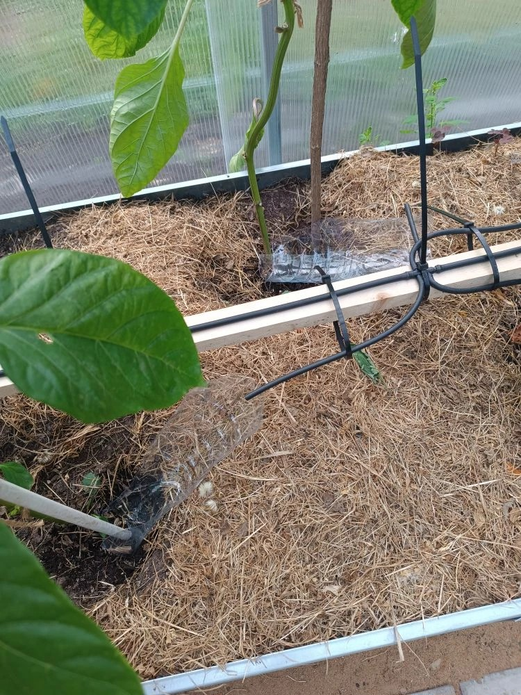
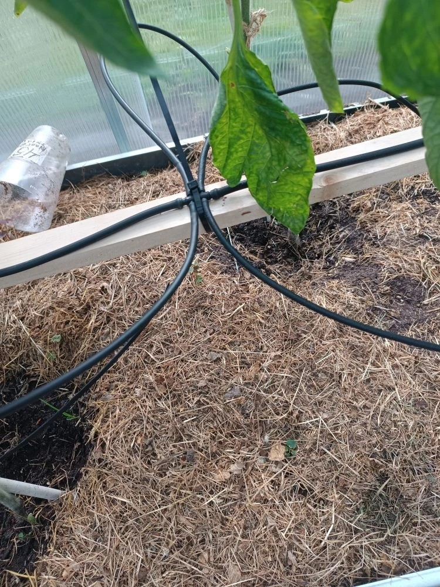
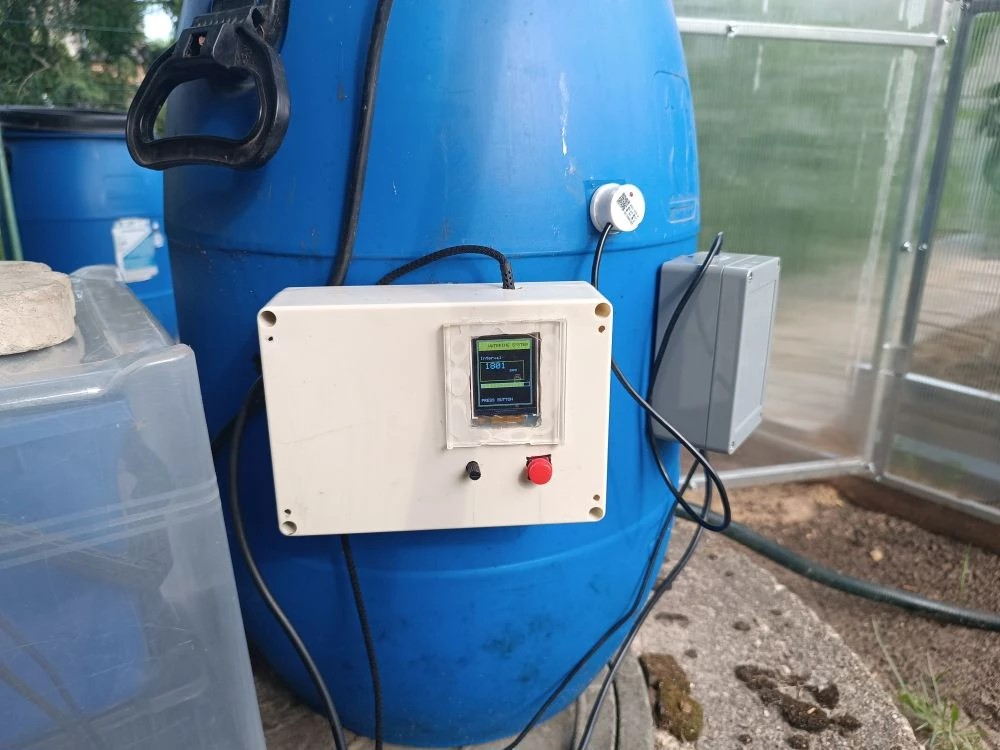
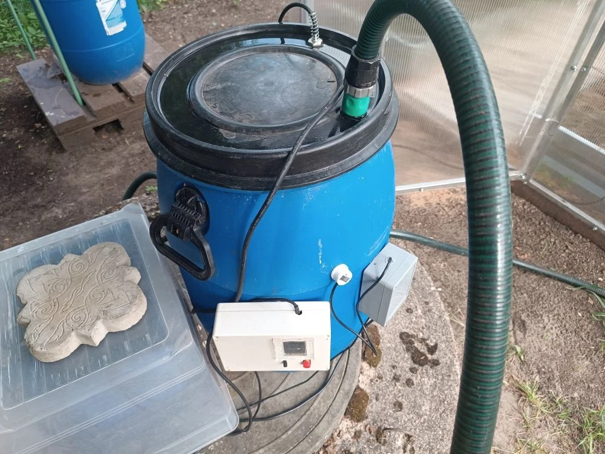

**GreenHouse Irrigation System** 🌱

Two independent Arduino projects in one repository.

---

**📁 aquaflora** - Manual watering with TFT display

Set watering duration (1-2048 sec) using potentiometer → press button to start. Shows countdown and progress bar on ST7735 display.

**Hardware:** ST7735 display, relay, button, potentiometer

---

**📁 bochka** - Automatic water tank control

Sensor detects no water for 30 min → pump turns ON. Water detected for 15 sec → pump turns OFF.

**Hardware:** relay, water level sensor

---

Both projects run on separate boards. No communication between them.

## The system in greenhouse




## The system in on the barrel




## Wiring


### 📁 aquaflora / (Manual + TFT)

| Component | Pin |
|-----------|-----|
| TFT CS | 10 |
| TFT RST | 9 |
| TFT DC | 8 |
| TFT MOSI | 11 |
| TFT SCK | 13 |
| Relay (pump) | 3 |
| Button | 2 |
| Potentiometer | A0 |
| TFT VCC | 5V |
| Все GND | GND |

---

### 📁 bochka / (Auto tank)

| Component | Pin |
|-----------|-----|
| Relay (pump) | 3 |
| Water sensor | 2 |
| VCC | 5V |
| GND | GND |
---
Folder structure for repo:

```
greenhouse-irrigation-system/
├── aquaflora/           # Project 1 (manual watering with display)
│   ├── photos/
│   └── README.md
├── bochka/              # Project 2 (auto-completion of the barrel)
│   ├── photos/
│   ├── README.md
│   └── bochka.ino
└── README.md            # Main README
```

